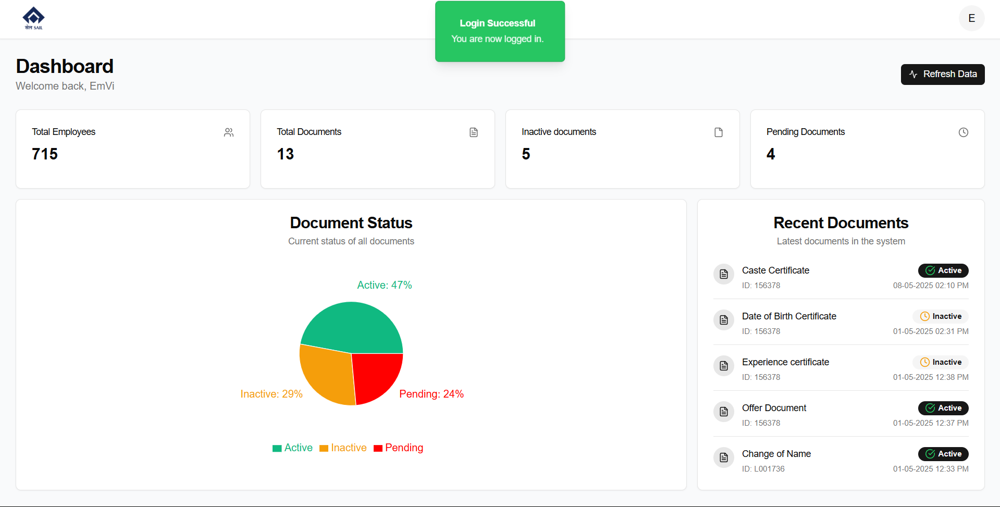
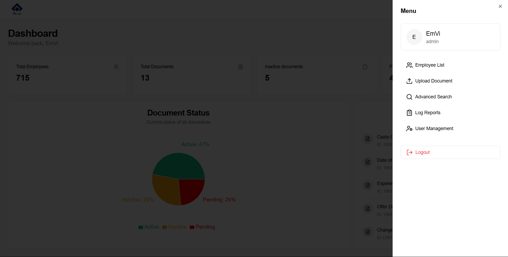
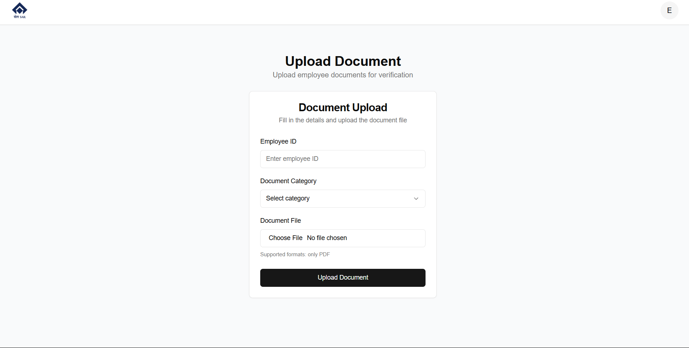
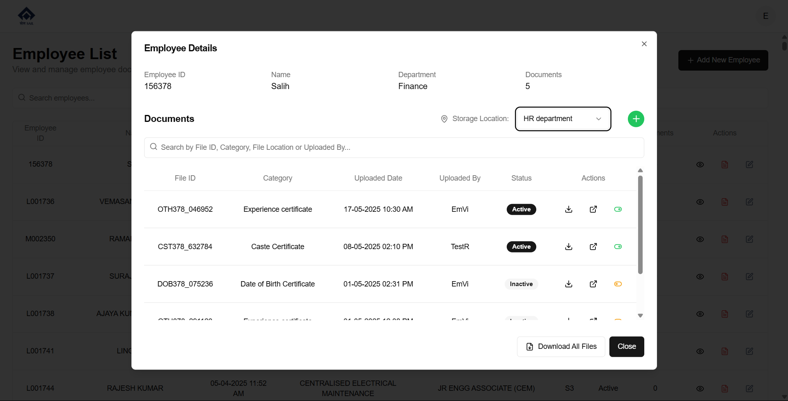

# 📂 Document Management System – Sample Project

---

A secure and efficient **document management system** designed for enterprise-level organizations to streamline employee document workflows and replace manual processing.

> ⚠️ This repository contains a **sanitized sample version** of a real-world project built and deployed for a major government organization. All sensitive details, logic, and data have been removed or altered for confidentiality.

Demo login credentials:
```md
- user: EmVi, pass: Admin123
- user: EmVeeh, pass: password123
```
---


## 🚀 Features (Sample Showcase)

- 🔐 Role-based login (Admin & HR roles)
- 🧑‍💼 Employee document upload and management
- 📍 Document location/status tracking
- 🔎 Advanced search by document status, employee ID, name, etc.
- 📝 System log overview
- 🧭 Admin dashboard for overview and control

---

## 🛠️ Tech Stack

| Layer            | Tech           |
|------------------|----------------|
| Frontend         | Next.js        |
| Backend API      | Fastify (Node.js) |
| Database         | MySQL          |
| Auth             | JWT-based auth |
| Deployment       | Apache (original), Render/Vercel (demo)

---

## 🧱 Project Structure

/frontend         # Next.js sample frontend
/backend          # Fastify backend (sample logic only)
/database         # SQL schema (sanitized)
/uploads          # Placeholder for file handling

---

## ⚠️ Disclaimer

- This project is a **simplified, redacted version** of a production-grade system.
- **Sensitive controller logic, authentication flows, real database schema, internal APIs, and real data are excluded.**
- Code is intended for **educational and portfolio showcase** purposes only.

---

## 📸 Screenshots

### 🧭 Dashboard


### 🔐 SideBar


### 📄 Upload Document


### 📄 Document List

---

## 🧪 Local Setup (Sample)

```bash
# Frontend
cd frontend
npm install
npm run dev

# Backend
cd backend
npm install
npm run dev
````

Use a `.env` file to configure local DB credentials.

---

## 🧑‍💻 Sample Users

- remember to give bcrypt hashed passwords when implementing

```sql
INSERT INTO user (username, password, role) VALUES ('admin_user', 'admin123', 'admin');
INSERT INTO user (username, password, role) VALUES ('hr_user', 'hr123', 'HR');
```

---


## 🧑‍💻 Developer

Built and maintained by **EmVi**
*(This version is stripped down and free of confidential content.)*

---

## 📜 License

This repository is open for educational and non-commercial use only.
You are not allowed to reuse the sensitive architecture or deploy the system with real data.


